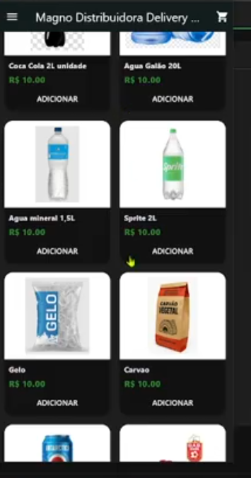
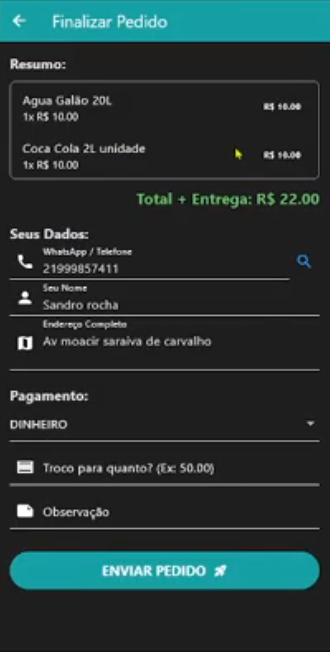
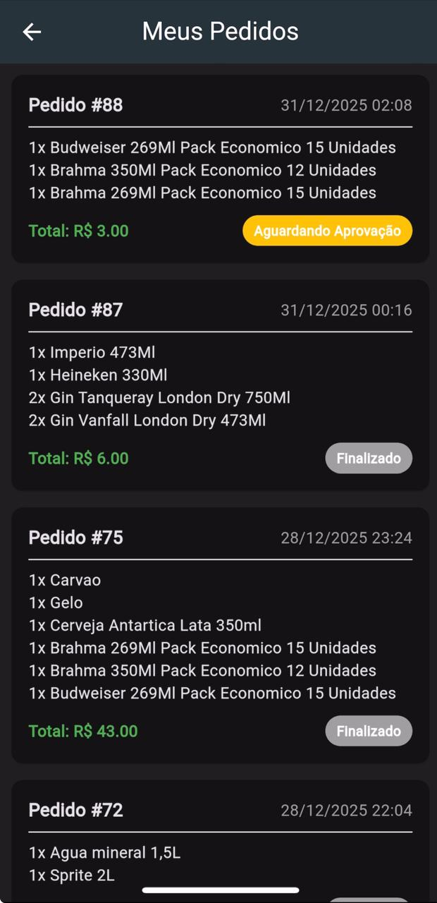
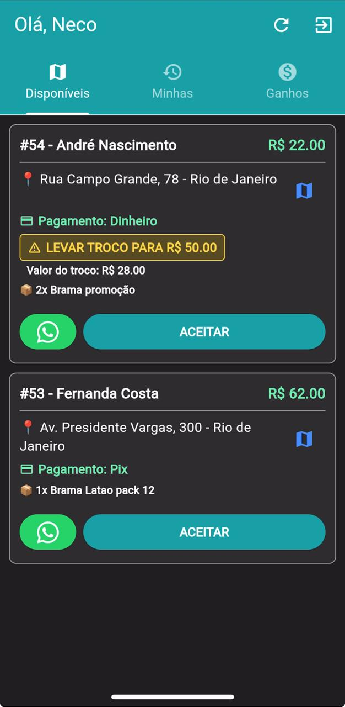
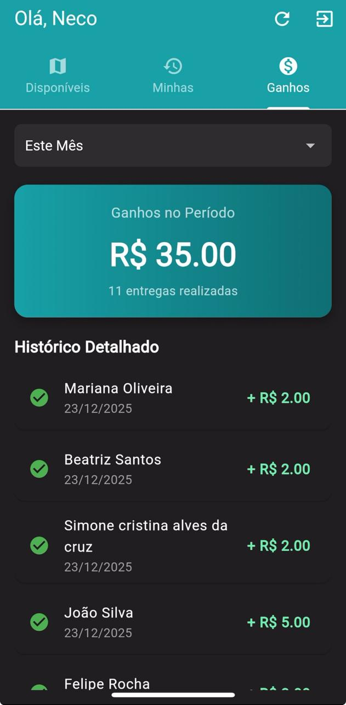
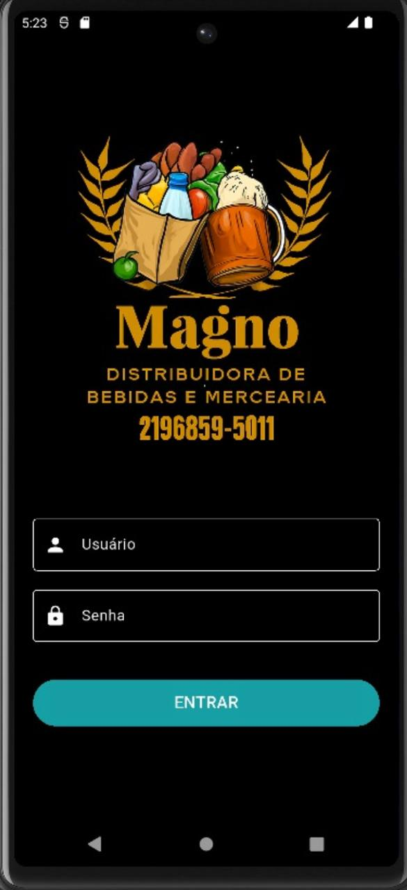

# 📱 Delivery App (Flutter Frontend)

> Interface móvel e web para o Sistema SaaS de Delivery, integrada ao backend Django. Inclui aplicativos dedicados para **Clientes** e **Entregadores (Motoboys)**.

## 📖 Sobre o Projeto

Este repositório contém o código-fonte dos aplicativos front-end do ecossistema de delivery. O projeto é estruturado para permitir a compilação de múltiplos aplicativos (Cliente e Motoboy) a partir da mesma base de código, compartilhando modelos, configurações e lógica de negócios.

### 🚀 Funcionalidades

#### 🛍️ App do Cliente
* **Vitrine Virtual:** Visualização de produtos em tempo real com busca inteligente.
* **Carrinho de Compras:** Gestão local de itens e cálculo de total.
* **Pedidos:** Envio de pedidos diretamente para o painel administrativo.
* **Histórico:** Acompanhamento de pedidos anteriores e status atual.

#### 🛵 App do Motoboy
* **Painel de Entregas:** Visualização de pedidos prontos para entrega com detalhes completos.
* **📍 Navegação GPS:** Integração nativa com **Google Maps** (e Waze) para traçar rotas automáticas até o endereço do cliente com um clique.
* **💬 Comunicação Rápida:** Botão de **WhatsApp** integrado que redireciona para o chat do cliente sem necessidade de salvar o número na agenda.
* **Gestão de Status:** Atualização em tempo real dos pedidos (Saiu para entrega / Entregue).
* **Perfil:** Visualização de dados e métricas do entregador.

---

## 📸 Screenshots

### App do Cliente (Visão do Usuário)

| Vitrine de Produtos | Busca & Filtro | Carrinho de Compras |
|:---:|:---:|:---:|
|  |  |  |
| *Navegação intuitiva* | *Pesquisa rápida* | *Gestão de itens* |

### App do Motoboy (Visão do Entregador)

| Lista de Pedidos | Detalhes & Ações | Integração Maps/Zap |
|:---:|:---:|:---:|
|  |  |  |
| *Painel em tempo real* | *Informações do cliente* | *Botões de ação direta* |

---

## 🛠️ Tecnologias Utilizadas

* **Framework:** [Flutter](https://flutter.dev/) (Google)
* **Linguagem:** [Dart](https://dart.dev/)
* **Comunicação API:** `http` (Consumo de REST API do Django)
* **Mapas & Rotas:** `url_launcher` (Para integração com Maps e WhatsApp)
* **Serialização:** `dart:convert` (JSON Parsing)
* **Gerenciamento de Estado:** `setState` (Nativo) e Lógica de Componentes.
* **Armazenamento Local:** `shared_preferences` (Para persistência de sessão e tokens).
* **Renderização Web:** HTML Renderer (para compatibilidade máxima).

---

## ⚙️ Como Rodar o Projeto

### Pré-requisitos
* Flutter SDK instalado.
* Backend Django rodando (Local ou PythonAnywhere).

